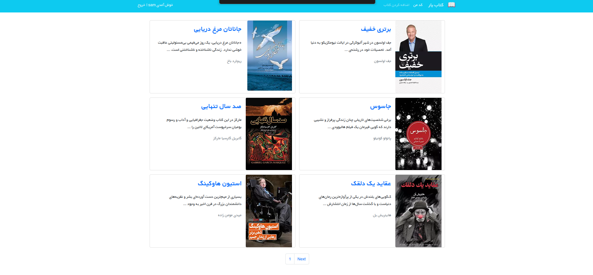
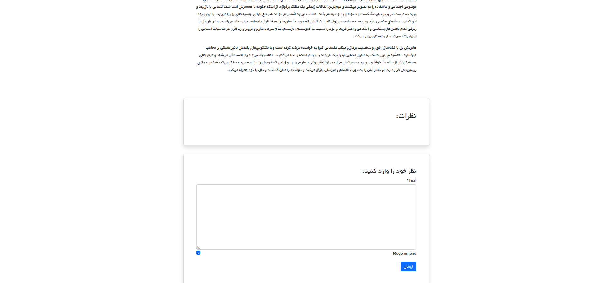

# Bookstore

A simple Django web app for browsing, adding, and reviewing books.

## Features

- Browse a paginated list of books
- View book details along with user comments
- Logged-in users can leave comments on a book
- Logged-in users can add new books
- Only the owner of a book can edit or delete it
- User authentication (login/register)

## Tech Stack

- Python / Django
- Django class-based views (ListView, CreateView, UpdateView, DeleteView)
- Django auth & permissions (`login_required`, `LoginRequiredMixin`)

## Main Views

- `BooksListView` — paginated list of all books
- `book_detail_view` — book details + comment form
- `BooksCreateView` — add a new book (logged-in users only)
- `BookUpdateView` — edit a book (owner only)
- `BookDeleteView` — delete a book (owner only)